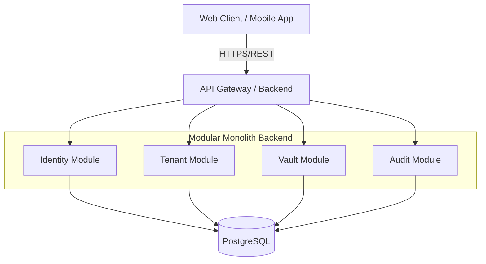

# Architecture Overview

## Introduction
The Private Data Manager platform is designed as a secure, zero-knowledge, multi-tenant system for storing private data. It follows a modular monolith architecture to ensure maintainability, scalability, and ease of deployment.

## High-Level Architecture

The system consists of the following main components:

1.  **Client Layer**:
    *   **Web Application**: A Single Page Application (SPA) built with React, Vite, Styled-Components, and Tailwind CSS.
    *   **Mobile Apps**: (Future scope) Native or cross-platform apps.
2.  **API Gateway / Load Balancer**: Entry point for all client requests (Nginx or similar in production, direct Kestrel in dev).
3.  **Application Server (Modular Monolith)**:
    *   Built with .NET Core (Latest LTS).
    *   Hosts REST APIs.
    *   Implements business logic, authentication, and authorization.
    *   Modules: Identity, Tenant Management, Private Data, Audit Logs.
4.  **Data Layer**:
    *   **Database**: PostgreSQL accessed via EF Core.
    *   **Storage**: File storage for documents/media (Local filesystem or S3-compatible).

## Modular Monolith Design

The backend is structured as a modular monolith. Each module has its own:
*   API Endpoints (Controllers)
*   Application Logic (Services/Handlers)
*   Domain Model
*   Infrastructure (Repositories, DB Context slices)

### Core Modules
*   **Identity Module**: Handles system-level users, authentication (JWT, OAuth2), and system roles.
*   **Tenant Module**: Handles tenant creation, membership, and tenant-level roles.
*   **Vault Module**: Core zero-knowledge storage logic. Handles encryption/decryption client-side (conceptually) and storage of encrypted blobs.
*   **Audit Module**: centralized logging of all user actions.

## Technology Stack

*   **Backend**: .NET Core (Latest LTS), C#, Entity Framework Core.
*   **Database**: PostgreSQL.
*   **Frontend**: React, TypeScript, Vite, Styled-Components, Tailwind CSS.
*   **Containerization**: Docker, Docker Compose.
*   **Testing**: xUnit, Testcontainers.

## Zero-Knowledge Architecture
*   **Client-Side Encryption**: Data is encrypted on the client side before being sent to the server.
*   **Master Key**: Each tenant has a master key, never stored in plain text on the server.
*   **Key Management**: Keys are derived from user passwords or managed via a secure key exchange mechanism (details in Security Design).

## Diagram

