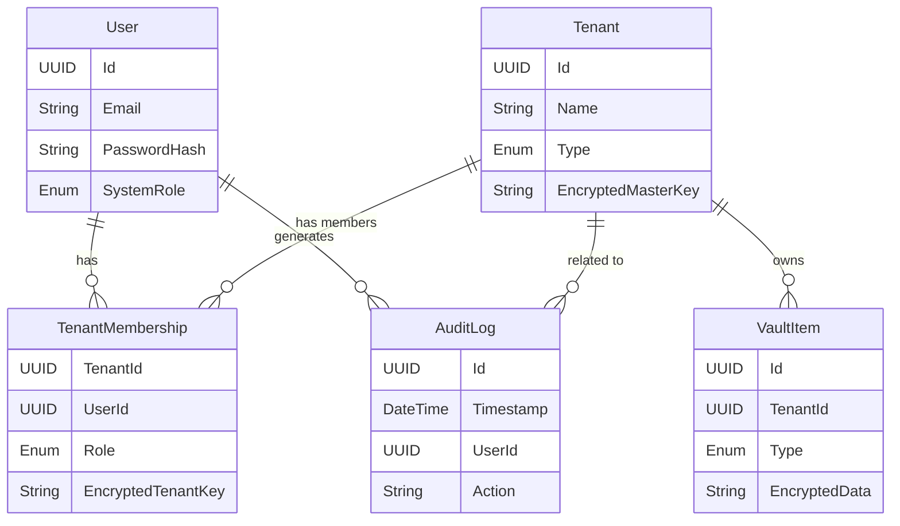

# Data Model

## Overview
The database uses a relational model (PostgreSQL) to store system configuration, user data, and encrypted vault items.

## Entities

### System & Identity
*   **User**
    *   `Id`: UUID (PK)
    *   `Email`: String (Unique)
    *   `PasswordHash`: String
    *   `CreatedAt`: DateTime
    *   `SystemRole`: Enum (Admin, Member)
    *   `IndividualTenantId`: UUID (FK to Tenant) - The user's personal tenant.

*   **RefreshToken**
    *   `Id`: UUID (PK)
    *   `UserId`: UUID (FK)
    *   `Token`: String
    *   `ExpiresAt`: DateTime

### Multi-Tenancy
*   **Tenant**
    *   `Id`: UUID (PK)
    *   `Name`: String
    *   `Type`: Enum (Individual, Organization)
    *   `EncryptedMasterKey`: String (The tenant's master key, encrypted by... see Security Design)
    *   `CreatedAt`: DateTime

*   **TenantMembership**
    *   `TenantId`: UUID (FK)
    *   `UserId`: UUID (FK)
    *   `Role`: Enum (TenantAdmin, TenantMember)
    *   `EncryptedTenantKey`: String (The tenant's master key, encrypted with the user's public key or derived key)
    *   *PK*: (TenantId, UserId)

### Vault (Private Data)
*   **VaultItem**
    *   `Id`: UUID (PK)
    *   `TenantId`: UUID (FK)
    *   `Type`: Enum (Credential, Document, Note, Media)
    *   `EncryptedData`: String (JSON blob encrypted with Tenant Master Key)
    *   `Metadata`: JSONB (Unencrypted metadata for filtering, e.g., name, tags - *careful with privacy*)
    *   `CreatedAt`: DateTime
    *   `UpdatedAt`: DateTime
    *   `CreatedBy`: UUID (FK to User)

### Audit
*   **AuditLog**
    *   `Id`: UUID (PK)
    *   `Timestamp`: DateTime
    *   `UserId`: UUID (FK)
    *   `Action`: String (e.g., "LOGIN", "CREATE_ITEM", "DELETE_USER")
    *   `TenantId`: UUID (Nullable FK)
    *   `Details`: JSONB (Contextual info)

## ER Diagram

