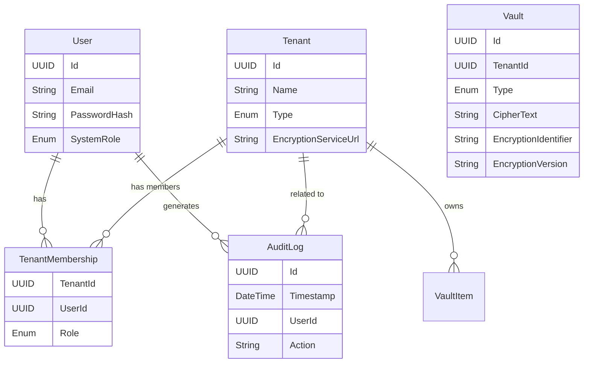

# Data Model

## Overview
The database uses a relational model (PostgreSQL) to store system configuration, user data, and encrypted vault items.

## Entities

### System & Identity
*   **User**
    *   `Id`: UUID (PK)
    *   `Email`: String (Unique)
    *   `PasswordHash`: String
    *   `SystemRole`: Enum (Admin, Member)
    *   `IndividualTenantId`: UUID (FK to Tenant)
    *   `CreatedAt`: Timestamp
    *   `CreatedAtUtc`: DateTime
    *   `CreatedBy`: UUID (Nullable - System)
    *   `UpdatedAt`: Timestamp
    *   `UpdatedAtUtc`: DateTime
    *   `UpdatedBy`: UUID (Nullable)

*   **RefreshToken**
    *   `Id`: UUID (PK)
    *   `UserId`: UUID (FK)
    *   `Token`: String
    *   `ExpiresAt`: DateTime

### Multi-Tenancy
*   **Tenant**
    *   `Id`: UUID (PK)
    *   `Name`: String
    *   `Type`: Enum (Individual, Organization)
    *   `EncryptionServiceUrl`: String (Nullable, overrides default)
    *   `EncryptionConfig`: JSONB (Auth credentials, etc.)
    *   `EncryptionId`: UUID (The root identifier for this tenant's keys in the Encryption Service)
    *   `CreatedAt`: Timestamp
    *   `CreatedAtUtc`: DateTime
    *   `CreatedBy`: UUID
    *   `UpdatedAt`: Timestamp
    *   `UpdatedAtUtc`: DateTime
    *   `UpdatedBy`: UUID

*   **TenantMembership**
    *   `TenantId`: UUID (FK)
    *   `UserId`: UUID (FK)
    *   `Role`: Enum (TenantAdmin, TenantMember)
    *   `CreatedAt`: Timestamp
    *   `CreatedAtUtc`: DateTime
    *   `CreatedBy`: UUID
    *   `UpdatedAt`: Timestamp
    *   `UpdatedAtUtc`: DateTime
    *   `UpdatedBy`: UUID
    *   *PK*: (TenantId, UserId)

### Vault (Private Data)
*   **Vault**
    *   `Id`: UUID (PK)
    *   `TenantId`: UUID (FK)
    *   `Type`: Enum (Credential, Document, Note, Media)
    *   `CipherText`: String (Encrypted content)
    *   `EncryptionIdentifier`: String (UUID/ID of the key used)
    *   `EncryptionVersion`: String (Version of the key used)
    *   `EncryptionMetadata`: JSONB (IV, Nonce, etc.)
    *   `Metadata`: JSONB (Unencrypted metadata for filtering/searching)
    *   `CreatedAt`: Timestamp
    *   `CreatedAtUtc`: DateTime
    *   `CreatedBy`: UUID (FK to User)
    *   `UpdatedAt`: Timestamp
    *   `UpdatedAtUtc`: DateTime
    *   `UpdatedBy`: UUID

### Audit
*   **AuditLog**
    *   `Id`: UUID (PK)
    *   `Timestamp`: DateTime
    *   `UserId`: UUID (FK)
    *   `Action`: String (e.g., "LOGIN", "CREATE_ITEM", "DELETE_USER")
    *   `TenantId`: UUID (Nullable FK)
    *   `Details`: JSONB (Contextual info)

### Encryption Service (Internal Database - Default Implementation)
*   **EncryptionContext**
    *   `Id`: UUID (PK) - Corresponds to `EncryptionId` in Tenant.
    *   `MasterKeyHash`: String (Hash of the master key for verification)
    *   `CurrentSymmetricVersion`: Int
    *   `CurrentAsymmetricVersion`: Int

*   **EncryptionKeyVersion**
    *   `ContextId`: UUID (FK)
    *   `Version`: Int
    *   `Type`: Enum (Symmetric, Asymmetric)
    *   `Algorithm`: String (e.g., "AES-256-GCM", "RSA-4096")
    *   `EncryptedKeyMaterial`: String (The actual key, encrypted by the Master Key)
    *   `Status`: Enum (Active, Archived)
    *   `CreatedAt`: DateTime

## ER Diagram

