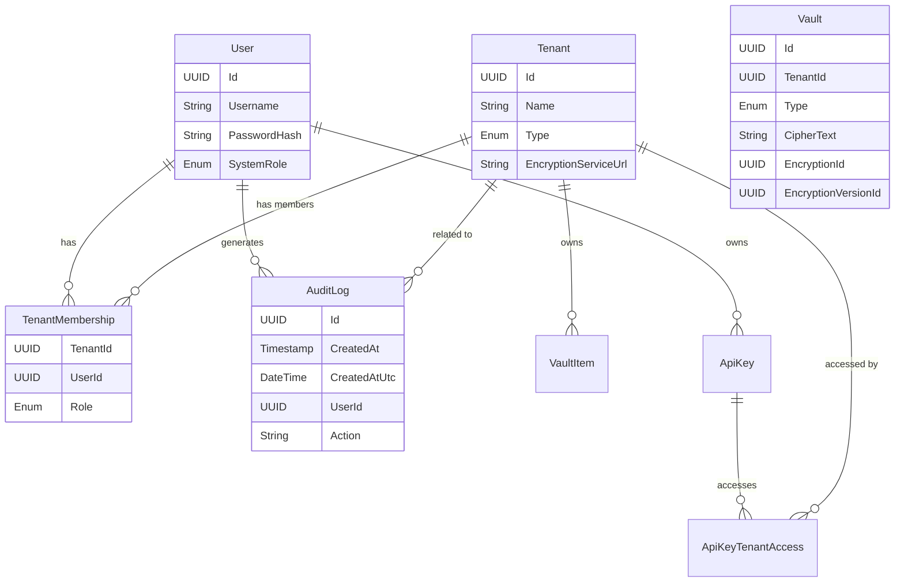

# Data Model

## Overview

The database uses a relational model (PostgreSQL) to store system configuration, user data, and encrypted vault items.

## Vertical Slice Persistence Access

Repositories and query helpers live inside each module's `Features/Persistence` folder and operate on entities defined exclusively in `Afina.Data`. They DO NOT redefine entities or migrations. Handlers depend on repository abstractions, keeping EF Core details localized.

## Entities

### System & Identity

- **User**

  - `Id`: UUID (PK)
  - `Username`: String (Unique)
  - `PasswordHash`: String
  - `PasswordHint`: String (Nullable)
  - `SystemRole`: Enum (Admin, Member)
  - `IndividualTenantId`: UUID (FK to Tenant)
  - `CreatedAt`: Timestamp
  - `CreatedAtUtc`: DateTime
  - `CreatedBy`: UUID (Nullable - System)
  - `UpdatedAt`: Timestamp
  - `UpdatedAtUtc`: DateTime
  - `UpdatedBy`: UUID (Nullable)

- **RefreshToken**

  - `Id`: UUID (PK)
  - `UserId`: UUID (FK)
  - `Token`: String
  - `ExpiresAt`: DateTime
  - `CreatedAt`: Timestamp
  - `CreatedAtUtc`: DateTime
  - `CreatedBy`: UUID
  - `UpdatedAt`: Timestamp
  - `UpdatedAtUtc`: DateTime
  - `UpdatedBy`: UUID

- **ApiKey**

  - `Id`: UUID (PK)
  - `UserId`: UUID (FK)
  - `Name`: String (Friendly name)
  - `KeyPrefix`: String (First few chars for display)
  - `SecretHash`: String (Hashed secret)
  - `Scopes`: JSONB (List of allowed actions: "EXPORT", "ROTATE", "USER_MGMT")
  - `ExpiresAt`: DateTime (Nullable)
  - `CreatedAt`: Timestamp
  - `CreatedAtUtc`: DateTime
  - `CreatedBy`: UUID
  - `UpdatedAt`: Timestamp
  - `UpdatedAtUtc`: DateTime
  - `UpdatedBy`: UUID

- **ApiKeyTenantAccess**
  - `ApiKeyId`: UUID (FK)
  - `TenantId`: UUID (FK)
  - `CreatedAt`: Timestamp
  - `CreatedAtUtc`: DateTime
  - `CreatedBy`: UUID
  - _PK_: (ApiKeyId, TenantId)

### Multi-Tenancy

- **Tenant**

  - `Id`: UUID (PK)
  - `Name`: String
  - `Type`: Enum (Individual, Organization)
  - `EncryptionServiceUrl`: String (Nullable, overrides default)
  - `EncryptionConfig`: JSONB (Auth credentials, etc.)
  - `EncryptionId`: UUID (The root identifier for this tenant's keys in the Encryption Service)
  - `CreatedAt`: Timestamp
  - `CreatedAtUtc`: DateTime
  - `CreatedBy`: UUID
  - `UpdatedAt`: Timestamp
  - `UpdatedAtUtc`: DateTime
  - `UpdatedBy`: UUID

- **TenantMembership**
  - `TenantId`: UUID (FK)
  - `UserId`: UUID (FK)
  - `Role`: Enum (TenantAdmin, TenantMember)
  - `CreatedAt`: Timestamp
  - `CreatedAtUtc`: DateTime
  - `CreatedBy`: UUID
  - `UpdatedAt`: Timestamp
  - `UpdatedAtUtc`: DateTime
  - `UpdatedBy`: UUID
  - _PK_: (TenantId, UserId)

### Vault (Private Data)

- **Vault**
  - `Id`: UUID (PK)
  - `TenantId`: UUID (FK)
  - `Type`: Enum (Credential, Document, Note, Media)
  - `CipherText`: String (Encrypted content)
  - `EncryptionId`: UUID (ID of the encryption context)
  - `EncryptionVersionId`: UUID (ID of the specific key version used)
  - `EncryptionMetadata`: JSONB (IV, Nonce, etc.)
  - `Metadata`: JSONB (Unencrypted metadata for filtering/searching)
  - `CreatedAt`: Timestamp
  - `CreatedAtUtc`: DateTime
  - `CreatedBy`: UUID (FK to User)
  - `UpdatedAt`: Timestamp
  - `UpdatedAtUtc`: DateTime
  - `UpdatedBy`: UUID

### Audit

- **AuditLog**
  - `Id`: UUID (PK)
  - `CreatedAt`: Timestamp
  - `CreatedAtUtc`: DateTime
  - `UserId`: UUID (FK)
  - `Action`: String (e.g., "LOGIN", "CREATE_ITEM", "DELETE_USER")
  - `TenantId`: UUID (Nullable FK)
  - `Details`: JSONB (Contextual info)

### Encryption Service (Internal Database - Default Implementation)

- **Encryption**

  - `Id`: UUID (PK) - Corresponds to `EncryptionId` in Tenant.
  - `MasterKeyHash`: String (Hash of the master key for verification)
  - `CurrentSymmetricKeyId`: UUID (FK to EncryptionKeyVersion)
  - `CurrentAsymmetricKeyId`: UUID (FK to EncryptionKeyVersion)
  - `CreatedAt`: Timestamp
  - `CreatedAtUtc`: DateTime
  - `CreatedBy`: UUID
  - `UpdatedAt`: Timestamp
  - `UpdatedAtUtc`: DateTime
  - `UpdatedBy`: UUID

- **EncryptionKeyVersion**
  - `Id`: UUID (PK)
  - `EncryptionId`: UUID (FK)
  - `Type`: Enum (Symmetric, Asymmetric)
  - `Algorithm`: String (e.g., "AES-256-GCM", "RSA-4096")
  - `EncryptedKeyMaterial`: String (The actual key, encrypted by the Master Key)
  - `Status`: Enum (Active, Archived)
  - `CreatedAt`: Timestamp
  - `CreatedAtUtc`: DateTime
  - `CreatedBy`: UUID
  - `UpdatedAt`: Timestamp
  - `UpdatedAtUtc`: DateTime
  - `UpdatedBy`: UUID

## ER Diagram

