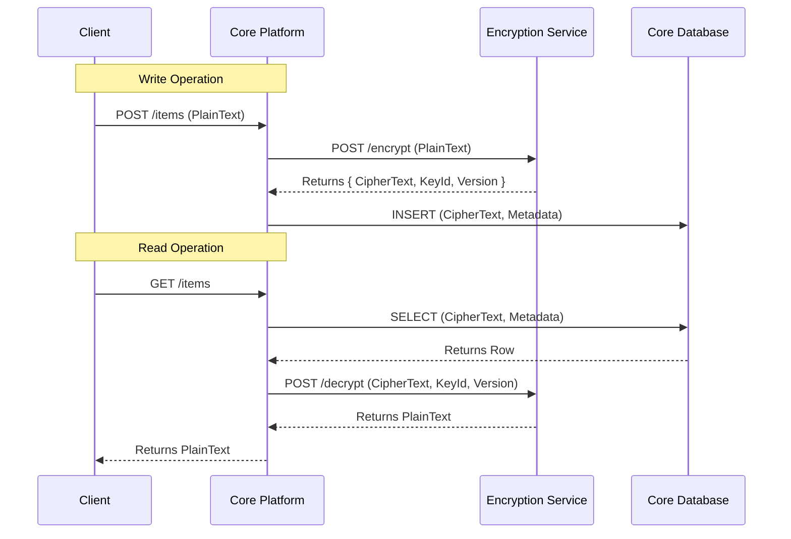

# Security & Encryption Design

## Overview
The platform uses a **Pluggable Encryption Architecture**. The core application does not handle encryption logic or key management directly. Instead, it delegates these operations to an **Encryption Service**.

This allows:
1.  **Zero-Knowledge (for the Core)**: The core database only stores encrypted blobs.
2.  **Sovereignty**: Tenants can host their own Encryption Service, ensuring they hold the keys.
3.  **Flexibility**: Support for different encryption algorithms and key management strategies (HSM, KMS, etc.).

## Encryption Service Contract
The Encryption Service must implement the following API contract. The Core Platform communicates with this service via HTTPS.

### 1. Encrypt Data
*   **Endpoint**: `POST /v1/encrypt`
*   **Headers**: `X-Master-Key` (Optional, if client-provided)
*   **Input**:
    *   `encryptionId`: UUID (Identifies the tenant's key context)
    *   `data`: String (Plain text or Base64)
    *   `encryptionVersionId`: UUID (Optional. If provided, uses this specific version.)
*   **Output**:
    *   `cipherText`: String (Base64)
    *   `encryptionId`: UUID
    *   `encryptionVersionId`: UUID (ID of the key version used)
    *   `algorithm`: String (e.g., "AES-256-GCM")
    *   `metadata`: JSON (Any additional info needed for decryption, e.g., IV/Nonce)

### 2. Decrypt Data
*   **Endpoint**: `POST /v1/decrypt`
*   **Headers**: `X-Master-Key` (Optional, if client-provided)
*   **Input**:
    *   `encryptionId`: UUID
    *   `cipherText`: String
    *   `encryptionVersionId`: UUID
    *   `metadata`: JSON
*   **Output**:
    *   `data`: String (Plain text)

### 3. Rotate Key
*   **Endpoint**: `POST /v1/rotate`
*   **Input**: `encryptionId`: UUID
*   **Output**: `newVersionId`: UUID
*   **Description**: Triggers the generation of a new active key version. Future encryptions will use this version. Old keys must be retained for decrypting existing data.

### Master Key Handling
The **Master Key** is used to encrypt the actual encryption keys (Symmetric/Asymmetric) stored in the Encryption Service database.
1.  **Platform-Managed**: Stored securely in the environment (Env Var, AWS KMS, Azure Key Vault). Used for standard tenants.
2.  **Client-Provided (Zero-Knowledge)**: Derived from the user's password. Passed in the `X-Master-Key` header for every request. The service does **not** store this key.

### Default Implementation (Internal)
The platform includes a default Encryption Service module.
*   **Storage**: Uses the `Encryption` and `EncryptionKeyVersion` tables.
*   **Logic**: Maps `EncryptionId` -> `Encryption`. Fetches active `EncryptionKeyVersion`. Decrypts the key material using the Master Key. Performs AES/RSA operations.

### Key Hierarchy
*   **Tenant Scope**: Keys are isolated per tenant.
*   **Key Versions**:
    *   Each encryption operation is tagged with an `EncryptionVersionId`.
    *   **Rotation**: When a rotation is triggered, a new key version becomes "Active".
    *   **Re-encryption**: A background process can read data (decrypt with old key) and write it back (encrypt with new key) to migrate data to the latest version.

### Storage
*   The **Encryption Service** is responsible for securely storing keys (e.g., in HashiCorp Vault, AWS KMS, or an encrypted database).
*   The **Core Platform** only stores the `KeyId` and `Version` as metadata.

## Authentication & Network Security

## Authentication & Access Control

### 1. Human Flow (Interactive)
*   **Credentials**: Username + Password.
*   **MFA**: Optional but recommended (TOTP).
*   **Mechanism**: Exchange credentials for JWT.
*   **Recovery**: **No Password Recovery**. The system is Zero-Knowledge. If the password is lost, the data is lost.
    *   **Password Hint**: Users can set a hint to help them remember their password. This hint is stored in plain text.
*   **Permissions**: **Full Access** based on roles.
    *   Can CRUD Private Data (Vault).
    *   Can Manage Users/Tenants.

### 2. System Flow (Machine-to-Machine)
*   **Credentials**: API Key + API Secret.
*   **Mechanism**: Passed via HTTP Headers (`X-Api-Key`, `X-Api-Secret`).
*   **Permissions**: **Restricted Access**.
    *   **Allowed**: Automation tasks (Export, Key Rotation, User Management).
    *   **DENIED**: CRUD operations on Private Data (Vault).
    *   *Note*: Can read encrypted blobs for backup/export purposes, but cannot modify them.

### Service-to-Service Auth
*   **Core <-> Encryption Service**:
    *   Mutual TLS (mTLS) recommended.
    *   API Key / Shared Secret (configured per tenant).

### Data in Transit
*   **TLS 1.3** is mandatory for all connections.
*   Data sent to the Encryption Service is plain text *over the wire* (protected by TLS), so the connection MUST be secure.

## Diagram: Encryption Flow

