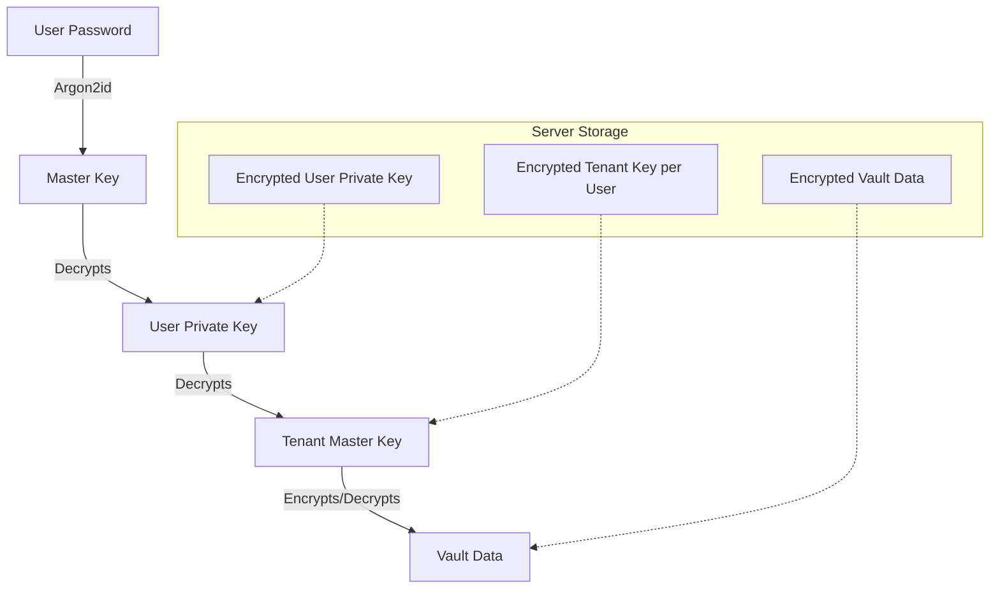

# Security & Zero-Knowledge Design

## Overview
The platform adopts a Zero-Knowledge (ZK) architecture. The server never sees the user's password or the unencrypted data. All encryption and decryption happen on the client side.

## Authentication & Key Derivation

### User Keys
1.  **Master Password**: Known only to the user.
2.  **Master Key**: Derived from Master Password using Argon2id (Client-side).
3.  **Auth Hash**: Derived from Master Key (e.g., HMAC-SHA256). Sent to server for authentication.
4.  **User Key Pair (RSA/ECC)**:
    *   Generated upon account creation.
    *   **Private Key**: Encrypted with the Master Key (AES-256-GCM) and stored on the server.
    *   **Public Key**: Stored in plain text on the server, available to other users for sharing.

### Tenant Keys
1.  **Tenant Master Key**: A symmetric key (AES-256) generated when a tenant is created.
2.  **Storage**:
    *   The Tenant Master Key is **never** stored in plain text.
    *   It is encrypted with the **Public Key** of each member who has access to the tenant.
    *   Stored in the `TenantMembership` table as `EncryptedTenantKey`.

## Data Encryption Flow

### Writing Data (Create/Update)
1.  Client generates a random IV/Nonce.
2.  Client encrypts the payload (JSON) using the **Tenant Master Key** (AES-256-GCM).
3.  Client sends `EncryptedData` and `IV` to the server.

### Reading Data
1.  Client requests data.
2.  Server returns `EncryptedData` and `IV`.
3.  Client decrypts the data using the **Tenant Master Key**.

## Sharing & Membership
When a user is added to a tenant:
1.  The admin (who has the decrypted Tenant Master Key) fetches the new user's **Public Key**.
2.  The admin encrypts the **Tenant Master Key** with the new user's Public Key.
3.  The admin sends this `EncryptedTenantKey` to the server to be stored in the new user's `TenantMembership` record.

## Network Security
*   **TLS 1.3**: All communication is encrypted in transit.
*   **HTTP Headers**: HSTS, CSP, X-Frame-Options enforced.

## Diagram: Key Hierarchy

